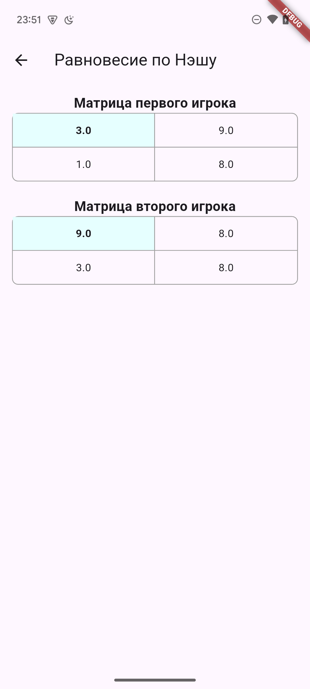

# Mind Games

Mind Games — это приложение, разработанное на Flutter для анализа и решения игровых матричных моделей. Приложение позволяет:
- Вычислять **максимин** и **манимакс** для игр с одной матрицей.
- Находить **равновесие по Нэшу** для биматричных моделей как в чистых, так и в смешанных стратегиях.
- Генерировать матрицы случайным образом и изменять их вручную.

## Особенности

- **Вычисление стратегий для одноматричных игр:** Определение оптимальных стратегий с использованием концепций максимина и манимакса.
- **Решение биматричных игр:** Расчёт равновесия по Нэшу в чистых и смешанных стратегиях.
- **Интерактивный интерфейс:** Возможность ручного редактирования матриц и генерация новых вариантов.
- **Кроссплатформенность:** Приложение работает на различных устройствах, поддерживаемых Flutter.

## Скриншоты

<div style="display: flex; justify-content: center; gap: 10px;">
  
  
  
</div>


## Структура проекта
Основной код приложения содержится в папке lib. В папке data - содержатся классы для описания типов данных. В папке widgets хранятся классы, описывающие интерфейс приложения.
```
lib
├── data
│   ├── game_provider.dart
│   ├── matrix.dart
│   ├── matrix_game.dart
│   └── nash_matrix.dart
├── main.dart
└── widgets
    ├── home_screen
    │   ├── algorithm_card_widget.dart
    │   ├── home_screen_widget.dart
    │   └── settings_screen_widget.dart
    ├── matrix_input_screen_widget.dart
    └── result_screens
        ├── maximin_screen_widget.dart
        ├── nash_balance_screen_widget.dart
        └── nash_equilibrium_screen.dart
```

## Установка

### Требования

- Flutter SDK (последняя стабильная версия)
- Dart SDK
- Подключённое устройство или эмулятор для тестирования

### Запуск проекта 

```bash
git clone https://github.com/your_username/mind-games.git
cd mind-games
flutter pub get
flutter run
```

